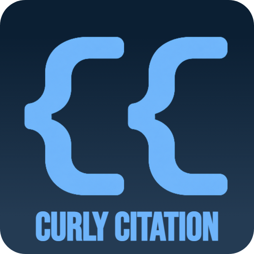

  

Curly Citation (Curly Shell, Curly Prefix, or simply Curly) is a compact citation format designed to reduce citation overhead in documents processed by Large Language Models (LLMs).

Instead of repeating bibliographic metadata, Curly represents citations using a compact numeric identifier and a resolvable endpoint.

## Why Curly?

Conventional citation styles repeat information such as authors, titles, journals, publication dates, DOIs, and URLs. While useful for human readers, this repetition increases input-token consumption when processing large documents with LLMs.

Curly minimizes this overhead while retaining the information needed to resolve cited sources.
